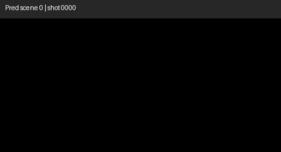

# MovieNet-318 Scene Segmentation

Reproducible notebooks for **movie scene boundary detection** on the [MovieNet-318](https://movienet.github.io/projects/cvpr20sceneseg.html) benchmark (190 train / 64 val / 64 test movies).

This repository contains labels, splits, shot timing, subtitles, and two end-to-end pipelines:

| Notebook | Description |
|----------|-------------|
| [`notebooks/test_keyframes.ipynb`](notebooks/test_keyframes.ipynb) | Clustering baselines with subtitle (MiniLM), visual (CLIP), and multimodal embeddings |
| [`notebooks/test_scene_seg_bassl.ipynb`](notebooks/test_scene_seg_bassl.ipynb) | BaSSL-inspired SSL pretraining + boundary-head finetuning on frozen CLIP features |

## Demo

Sample **predicted scene boundaries** from the BaSSL-inspired pipeline on a MovieNet-318 clip. Each segment shows keyframes grouped by the model’s predicted scene cuts (see the visualization cells in [`test_scene_seg_bassl.ipynb`](notebooks/test_scene_seg_bassl.ipynb)):

<p align="center">
  <a href="https://github.com/lwan1/movienet-scene-segmentation/blob/main/docs/assets/prediction.mp4">
    
  </a>
</p>

<p align="center"><em>Click the preview to open the full MP4 in GitHub’s built-in player.</em></p>

## Quick start

### 1. Clone the repository

```bash
git clone https://github.com/lwan1/movienet-scene-segmentation.git
cd movienet-scene-segmentation
pip install -r requirements.txt
```

### 2. Run a notebook (keyframes download automatically)

**Google Colab:** open either notebook, set `REPO_URL` in the setup cell to your fork, enable a GPU runtime, and run all cells. Keyframes are downloaded from Hugging Face on first run (~50 GB).

**Local Jupyter:**

```bash
jupyter notebook notebooks/test_keyframes.ipynb
```

Set `SCENE_SEG_REPO_DIR` to the repo root if the auto-detection cell does not find `data/scene318/`.

The notebooks download keyframes from **[asmith06/movienet318-keyframes-240p](https://huggingface.co/datasets/asmith06/movienet318-keyframes-240p)** and extract them to `data/keyframes_240p/`.

### Manual keyframe download (optional)

```bash
export HF_XET_HIGH_PERFORMANCE=1
hf download asmith06/movienet318-keyframes-240p keyframes_240p.zip \
  --repo-type dataset --local-dir data/
python scripts/setup_keyframes.py
```

See [`docs/download_keyframes.md`](docs/download_keyframes.md) for details and alternatives.

### Smoke test

In either notebook, set `LIMIT_MOVIES = 10` or `LIMIT_PER_SPLIT = 3` before the expensive embedding/training cells.

## Repository layout

```
movienet-scene-segmentation/
├── data/
│   ├── scene318/
│   │   ├── label318/          # per-movie scene boundary labels (318 files)
│   │   ├── meta/split318.json # official train/val/test split
│   │   └── shot_movie318/     # shot frame ranges for subtitle alignment
│   ├── subtitle/              # SRT files for 314/318 movies
│   ├── keyframes_240p.zip     # NOT in git — downloaded from Hugging Face
│   └── keyframes_240p/        # NOT in git — extracted keyframes
├── docs/
│   ├── assets/                # demo media (prediction.gif / prediction.mp4)
│   └── download_keyframes.md
├── notebooks/
├── scripts/
├── outputs/                   # NOT in git — embeddings, checkpoints, results
└── requirements.txt
```

Manifest CSV files and other MovieNet metadata dumps are **intentionally excluded**; only files required to run the notebooks are included.

## Data license & usage

MovieNet data (labels, keyframes, subtitles) is for **academic research only**. Do not redistribute outside the terms of the [MovieNet project](https://movienet.github.io/). By using this repo you agree to cite the original papers below.

## Acknowledgements

This project builds on open research and tooling from:

- **MovieNet** — dataset annotations, keyframes, and the MovieNet-318 scene segmentation benchmark ([Huang et al., ECCV 2020](https://movienet.github.io/projects/eccv20movienet.html))
- **LGSS** — Local-to-Global Scene Segmentation baseline and label convention ([Rao et al., CVPR 2020](https://movienet.github.io/projects/cvpr20sceneseg.html))
- **BaSSL** — boundary-aware self-supervised learning for scene segmentation ([Mun et al., ACCV 2022](https://arxiv.org/abs/2201.05277))
- **CLIP** — visual embeddings ([Radford et al., ICML 2021](https://arxiv.org/abs/2103.00020))
- **Sentence-Transformers** — subtitle text embeddings ([Reimers & Gurevych, EMNLP 2019](https://arxiv.org/abs/1908.10084))
- **MovieNet-318 keyframes on Hugging Face** — [asmith06/movienet318-keyframes-240p](https://huggingface.co/datasets/asmith06/movienet318-keyframes-240p)

Published reference numbers in the notebooks (TranS4mer, MEGA, Scene-VLM) are taken from recent literature surveys on MovieNet-318; see those papers for their experimental settings.

## Citations

If you use this code or the MovieNet-318 benchmark, please cite:

```bibtex
@inproceedings{huang2020movienet,
  title={MovieNet: A Holistic Dataset for Movie Understanding},
  author={Huang, Qingqiu and Xiong, Yu and Rao, Anyi and Wang, Jiaze and Lin, Dahua},
  booktitle={European Conference on Computer Vision (ECCV)},
  year={2020}
}

@inproceedings{rao2020local,
  title={A Local-to-Global Approach to Multi-Modal Movie Scene Segmentation},
  author={Rao, Anyi and Xu, Linning and Xiong, Yu and Xu, Guodong and Huang, Qingqiu and Zhou, Bolei and Lin, Dahua},
  booktitle={Proceedings of the IEEE/CVF Conference on Computer Vision and Pattern Recognition (CVPR)},
  pages={10146--10155},
  year={2020}
}

@inproceedings{mun2022bassl,
  title={BaSSL: Boundary-aware Self-Supervised Learning for Video Scene Segmentation},
  author={Mun, Jonghwan and Shin, Minchul and Han, Gunsoo and Lee, Sangho and Ha, Seongsu and Lee, Joonseok and Kim, Eun-Sol},
  booktitle={Proceedings of the Asian Conference on Computer Vision (ACCV)},
  pages={4027--4043},
  year={2022},
  url={https://arxiv.org/abs/2201.05277}
}
```

## Run in Colab

[](https://colab.research.google.com/github/lwan1/movienet-scene-segmentation/blob/main/notebooks/test_keyframes.ipynb)
[](https://colab.research.google.com/github/lwan1/movienet-scene-segmentation/blob/main/notebooks/test_scene_seg_bassl.ipynb)

Enable a **GPU runtime** before running. Keyframes (~50 GB) are downloaded from Hugging Face on first run.
